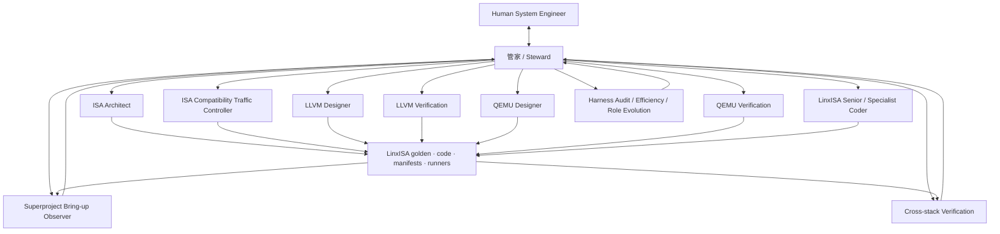

# Architecture

FishToucher separates human authority, steward orchestration, LinxISA domain delivery, independent proof, and canonical superproject evidence.



The steward is the sole routine human-facing coordinator. It preserves every layer's provenance and reports without relabeling a downstream symptom as an upstream cause. It may spawn registered roles; it may not implement silently, approve its own work, or take human-only decisions.

## Borrowed protocol ideas

FishToucher uses a small local subset of established systems:

- A2A: capability cards, stateful tasks, messages, artifacts, and references.
- AutoGen Core: a runtime owns agent lifecycle and message delivery.
- OpenAI Agents SDK: explicit handoffs and trace spans.
- LangGraph: supervisor routing and bounded handoff semantics.
- Codex native subagents: custom agents, model/reasoning configuration, permission inheritance, and bounded nesting.

It does not implement an A2A server, adopt open-ended group chat, or add those frameworks as dependencies. The local protocol remains `assignment → result → verdict`, with exceptional `escalation`. See [`protocol-research.md`](protocol-research.md) for sources and decisions.

## Registry and driver boundary

`config/linxisa.example.json` is the organization registry. Runtime validation checks capabilities and permissions, not known role ids. Effective authority is always:

```text
Role Card ∩ assignment ∩ runtime sandbox
```

Codex native agents, Codex SDK, or Codex MCP may implement the `codex` driver. DeepSeek remains a separate optional driver because the portable native spawn surface does not expose an arbitrary per-call provider selector. Both lanes implement:

```text
start(authorized assignment) → handle
follow_up(handle, bounded repair)
wait(handle) → result
cancel(handle)
```

Mailboxes keep compact contracts, not transcripts. Raw provider request/response logs are create-once mode-`0600` records outside source. LinxISA workload artifacts remain under `workloads/generated/<run-id>/`.
