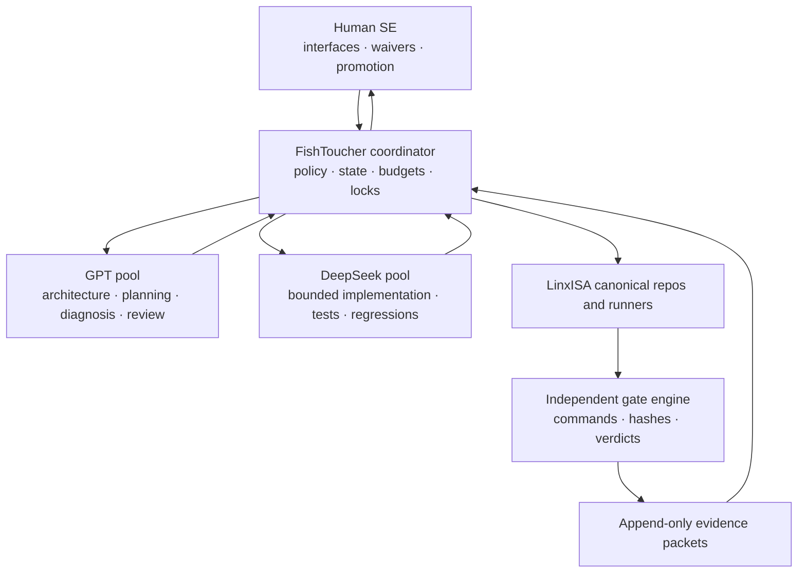
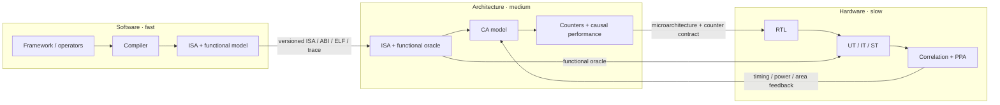

# Architecture

FishToucher separates nondeterministic reasoning from deterministic control. Agents propose patches and interpretations; the coordinator validates scope, executes locked commands, hashes artifacts, and computes gate status.

## Two nested feedback structures

FishToucher uses two different kinds of loop:

1. The **task control loop** authorizes one action, observes the environment, verifies evidence, and retries or escalates.
2. The **engineering loops** let software, architecture, and hardware progress at different cadences behind versioned interfaces.

## Deterministic plan, nondeterministic workers

A flow document compiles into an ordered plan. Ready work sorts by priority and packet ID. Concurrency is permitted only for disjoint write scopes and output directories. Provider output is never used as a gate result.

Future online adapters should implement a provider-neutral request/result protocol and load exact GPT and DeepSeek model names from environment configuration. Credentials must never enter flow documents, prompts, plans, logs, or evidence.

## Persistence

Runtime state should live outside the LinxISA checkout or in an explicitly approved location. LinxISA-generated workload artifacts remain under `workloads/generated/<run-id>/`. Each attempt gets a content-addressed evidence packet; failed attempts remain available for replay and audit.
